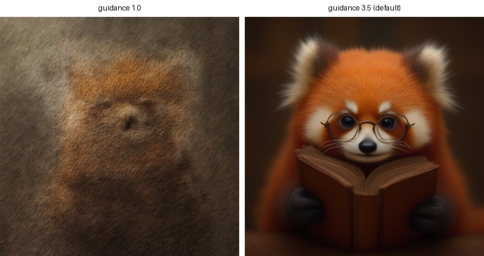

# FLUX.1-lite-8B on Trainium 上手实操

面向没接触过 Trainium 的读者，从登录机器到出图、看延时、看监控，一步一步走完。
每一步都给了参考输出，**因机型、区域、SDK 版本不同，你的输出会不一样，仅供对照**。

## 0. 参考文档与验证环境

文档地址

```
Neuron:  https://awsdocs-neuron.readthedocs-hosted.com/en/latest/index.html
NxDI:    https://github.com/aws-neuron/neuronx-distributed-inference
模型:     https://huggingface.co/Freepik/flux.1-lite-8B
```

本文全部命令在这台机器上实跑验证过：

```
区域：    sa-east-1
机型：    trn2.3xlarge      （1 颗 Trainium2，96 GB HBM）
系统：    Ubuntu 24.04.4 LTS
驱动：    aws-neuronx-dkms 2.30.2.0
LNC：     logical-neuroncore-config = 2  →  4 个 logical NeuronCore
```

> **和 trn1 的读者注意**：本文的默认 TP=4 对应 trn2 的 4 个 logical core。trn1.2xlarge
> 只有 2 个 core，需要用 `--tp-degree 2`；本文第 5 节说明了 TP 该怎么选。

FLUX.1-lite-8B 是 Freepik 把 FLUX.1-dev 蒸馏出来的文生图模型：同样的
`FluxTransformer2DModel`，双流（MMDiT）块从 19 个剪到 8 个，38 个单流块全部保留。

---

## 1. 登录确认

### A. 确认系统和实例信息

```shell
whoami
lsb_release -a
TOKEN=$(curl -s -X PUT "http://169.254.169.254/latest/api/token" \
  -H "X-aws-ec2-metadata-token-ttl-seconds: 60")
curl -s -H "X-aws-ec2-metadata-token: $TOKEN" http://169.254.169.254/latest/meta-data/instance-type; echo
curl -s -H "X-aws-ec2-metadata-token: $TOKEN" http://169.254.169.254/latest/meta-data/placement/region; echo
```

输出类似：

```
ssm-user
Distributor ID: Ubuntu
Description:    Ubuntu 24.04.4 LTS
Release:        24.04
Codename:       noble
trn2.3xlarge
sa-east-1
```

> 元数据用的是 IMDSv2（先取 token 再查询）。如果你的镜像还允许 IMDSv1，
> `curl -s http://169.254.169.254/latest/meta-data/instance-type` 也能直接返回。

用户名不一定是 `ubuntu`——AWS DLAMI 通常是 `ubuntu`，通过 SSM 登录则是 `ssm-user`。
本文用 `$HOME` 和相对路径，不假设具体用户。

### B. 确认 Neuron 驱动和硬件

```shell
neuron-ls
dpkg -l | grep -E "aws-neuronx-(dkms|runtime-lib|tools)" | awk '{print $2, $3}'
```

输出类似：

```
instance-type: trn2.3xlarge
instance-id: i-05cd290773905969e
logical-neuroncore-config: 2
+--------+--------+----------+--------+--------------+----------+------+
| NEURON | NEURON |  NEURON  | NEURON |     PCI      |   CPU    | NUMA |
| DEVICE | CORES  | CORE IDS | MEMORY |     BDF      | AFFINITY | NODE |
+--------+--------+----------+--------+--------------+----------+------+
| 0      | 4      | 0-3      | 96 GB  | 0000:33:00.0 | 0-11     | 0    |
+--------+--------+----------+--------+--------------+----------+------+

aws-neuronx-dkms 2.30.2.0
aws-neuronx-runtime-lib 2.34.10.0-ac18d186d
aws-neuronx-tools 2.32.28.0-526c2b7f6
```

如果 `neuron-ls` 提示 command not found，用全路径 `/opt/aws/neuron/bin/neuron-ls`，
或把它加进 PATH：

```shell
export PATH=/opt/aws/neuron/bin:$PATH
```

**版本和上面不一样、想对齐?** 用这个目录里的
[`setup_neuron_system.sh`](setup_neuron_system.sh):

```shell
./contrib/models/flux.1-lite-8B/setup_neuron_system.sh --check   # 只报告差异，不改任何东西
./contrib/models/flux.1-lite-8B/setup_neuron_system.sh           # 打印计划、确认后安装
```

它做四件事：比对这四个 apt 包、要换驱动时先确认没有进程占着 `/dev/neuron*`（有就拒绝，
不去打断正在跑的任务）、安装（必要时降级）、重载内核模块并验证。目标版本写在脚本顶部，
也可以用环境变量覆盖：`DKMS_VERSION=2.29.0.0 ./setup_neuron_system.sh`。

三个容易踩的点：

- **`runtime-lib` 和 `collectives` 必须同版本**（配套发布）。错配了只有在起张量并行时才报错，
  单核跑完全看不出来。
- **`dkms` 的版本号自成一套**（2.30.x vs 另外三个的 2.34.x/2.32.x），不要试图对齐。
- **换过内核就要重装 `aws-neuronx-dkms`**，否则模块不会为新内核编译，`/dev/neuron0` 会消失。

这是**系统层**，和 venv 无关——机器上所有 venv 共用同一个
`/opt/aws/neuron/lib/libnrt.so.1`。Python 那一半见
[`nxdi_requirements.txt`](nxdi_requirements.txt)。

`sudo dmesg | grep -i neuron` 可以看驱动加载记录。注意这里也会混进**以前跑失败留下的
运行时报错**，看到 ERROR 不要慌，先看时间戳是不是本次的。

### C. 确认预装虚拟环境

```shell
ls /opt | grep aws_neuronx_venv
```

标准 Neuron DLAMI 上会看到类似：

```
aws_neuronx_venv_jax_0_6
aws_neuronx_venv_pytorch_2_7
aws_neuronx_venv_pytorch_2_7_nxd_inference     <- 用这个
aws_neuronx_venv_pytorch_2_7_nxd_training
aws_neuronx_venv_pytorch_latest
aws_neuronx_venv_tensorflow_2_10
```

带 **`_nxd_inference`** 的那个就是本文要用的。版本号（`2_7`）随 AMI 不同，
下文统一写成 `<VENV>`，你按实际的填。

> 有的镜像只装了 vLLM 插件那套（`aws_neuronx_venv_pytorch_inference_vllm_*`），
> **它不能用来跑 NxDI**：那是 `libtorch-neuronx-lite` + torch 2.11 + transformers 5.x，
> 而 NxDI 要 `torch-neuronx` + torch 2.9 + transformers 4.57，装一起会互相踩。
> 这种情况见第 2 节 E 的兜底方案。

---

## 2. 准备 NxDI 环境

### A. 激活环境

```shell
source /opt/<VENV>/bin/activate          # 例：aws_neuronx_venv_pytorch_2_7_nxd_inference
```

第一次 activate 可能比较慢，耐心等。

### B. 克隆仓库，并让**这个仓库的**代码生效

```shell
cd ~
git clone https://github.com/qingzwang/neuronx-distributed-inference.git
cd neuronx-distributed-inference
git checkout model/flux1-lite-8B

# 这一步不能跳过
pip install -e . --no-deps
```

**为什么不能跳过。** DLAMI 的 venv 里已经预装了一份 NxDI，而这个模型用到的
`create_flux_config` 等 FLUX 接口在本仓库的 `src/` 里。不覆盖预装那份的话，
`import neuronx_distributed_inference` 会成功（所以"import 通了"并不能说明环境对了），
但真正跑起来会报：

```
ImportError: cannot import name 'create_flux_config' from
'neuronx_distributed_inference.models.diffusers.flux.application'
```

`--no-deps` 是必须的：否则 pip 会按 `setup.py` 把 torch / torch-neuronx / neuronx-cc
重装成别的版本，把预装环境弄坏（见 E）。

不想装到环境里的话，也可以每次靠 `PYTHONPATH` 把仓库顶到前面——但要记得每个 shell
都设一次：

```shell
export PYTHONPATH=$HOME/neuronx-distributed-inference/src:$PYTHONPATH
```

### C. 装 FLUX 的额外依赖

```shell
pip install "diffusers==0.32.0" accelerate
```

对应 `setup.py` 里的 `[flux]` extra。`diffusers` 要 **0.32.0**——FLUX 的
pipeline / VAE / 调度器都从它来，版本对不上会在加载时报错。

**想要完全一样的版本?** [`nxdi_requirements.txt`](nxdi_requirements.txt) 是本文这套环境的
`pip freeze`,可以直接拿来建一个新 venv:

```shell
python3 -m venv ~/venv-nxdi-flux
~/venv-nxdi-flux/bin/pip install -r contrib/models/flux.1-lite-8B/nxdi_requirements.txt \
    --extra-index-url https://pip.repos.neuron.amazonaws.com
# 然后照 B 那一步,让这个仓库成为被 import 的 NxDI
~/venv-nxdi-flux/bin/pip install -e . --no-deps
```

里面最要紧的一行是 `neuronx-cc==2.26.6360.0`——2.27 编 FLUX 会崩(见第 10 节)。
`neuronx-distributed-inference` 那一行是注释掉的:它就是这个仓库,靠上面的
`pip install -e . --no-deps` 装,而不是让 pip 再 clone 一份。

### D. 验证环境通了

```shell
cat > /tmp/verify_neuron.py << 'EOF'
import torch, torch_neuronx, neuronx_distributed, neuronx_distributed_inference as nxdi
import torch_xla.core.xla_model as xm

# 这一行是 B 那一步到底生效没有的判据：FLUX 的接口只在本仓库的 src/ 里
from neuronx_distributed_inference.models.diffusers.flux.application import (
    create_flux_config,
)

print("torch:", torch.__version__, "| torch_neuronx:", torch_neuronx.__version__)
print("nxdi:", nxdi.__file__)

d = xm.xla_device()
x = torch.randn(4, 4).to(d)
print("Neuron 上矩阵乘法 OK:", tuple((x @ x).cpu().shape))
print("✅ 环境验证通过")
EOF

python /tmp/verify_neuron.py
```

输出类似（中间会有一次真实编译，第一次要等十几秒）：

```
torch: 2.9.1+cu128 | torch_neuronx: 2.9.0.2.15.32035+de43f57c
nxdi: /home/ubuntu/neuronx-distributed-inference/src/neuronx_distributed_inference/__init__.py
...
Compiler status PASS
Neuron 上矩阵乘法 OK: (4, 4)
✅ 环境验证通过
```

会看到的**无害告警**，不用管：

```
UserWarning: Warning: Failed to import blockwise_mm_bwd: No module named
'neuronxcc.nki._private.blockwise_mm_bwd'
```

MoE 专用的 NKI kernel，FLUX 用不到。

**`nxdi:` 那一行必须是你 clone 出来的那个仓库的 `src/`。** 如果打印的是
`/opt/aws_neuronx_venv_.../site-packages/neuronx_distributed_inference/__init__.py`，
说明生效的还是预装那份，回到 B 重做——`create_flux_config` 那个 import 也会在这里
先炸出来。

### E. 兜底：机器上没有 `_nxd_inference` 环境时

<details>
<summary>展开（本文数据就是在这种机器上测的）</summary>

自己建一个：

```shell
python3 -m venv ~/venv-nxdi
source ~/venv-nxdi/bin/activate
pip install --upgrade pip

pip install "neuronx-distributed-inference==0.9.*" \
    --extra-index-url https://pip.repos.neuron.amazonaws.com
```

**⚠️ 装完必须降 neuronx-cc。** `libneuronxla 2.2` 只写了 `neuronx-cc~=2.0`，pip 会解析到
最新的 **2.27**，而这条 release train 用不了它——**任何编译都会失败**：

```
[NCC_ISMP902] Simplifier error: is_subset(): incompatible function arguments
```

```shell
pip install "neuronx-cc==2.26.6360.0" \
    --extra-index-url https://pip.repos.neuron.amazonaws.com
```

然后按 B / C / D 继续，但 B 的 `pip install -e .` 要加 `--no-deps`，否则 pip 会按
`setup.py` 把 `neuronx-cc` 再拉回最新版：

```shell
pip install -e . --no-deps
```

预装环境里版本已经配好，不会遇到这个问题。

</details>

最终版本组合（本文验证过的）：

```
torch 2.9.1 | torch-xla 2.9.0 | torch-neuronx 2.9.0.2.15.32035
neuronx-distributed 0.19.28492 | libneuronxla 2.2.17544 | neuronx-cc 2.26.6360.0
transformers 4.57.6 | diffusers 0.32.0 | Python 3.12.3
```

---

## 3. 下载模型

```shell
pip install "huggingface_hub[cli]>=0.30.0"

export HF_HOME=~/hf-cache
mkdir -p ~/models

hf download Freepik/flux.1-lite-8B \
  --local-dir ~/models/flux.1-lite-8B \
  --exclude "flux.1-lite-8B.safetensors" \
  --exclude "sample_images/*" \
  --exclude "comfy/*"

ls ~/models/flux.1-lite-8B/
```

三个 `--exclude` 省掉约 16 GB：`flux.1-lite-8B.safetensors` 是单文件打包版（diffusers
用不到分目录之外的它），另两个是示例图和 ComfyUI 工作流。

> **注意 `--exclude` 要每个都单独写一次。** 写成
> `--exclude "a" "b" "c"` 的话，后面两个会被当成"要下载的文件名"，
> 结果只下几十 MB 就"成功"了。

输出类似：

```
.cache/  README.md  model_index.json  scheduler/
text_encoder/  text_encoder_2/  tokenizer/  tokenizer_2/  transformer/  vae/
```

这是标准的 diffusers 目录结构，其中 `transformer/`、`text_encoder/`、
`text_encoder_2/`、`vae/` 是必须的。实测各部分大小：

| 目录 | 大小 |
|---|---|
| `transformer/` | 16 GB |
| `text_encoder_2/`（T5-XXL） | 8.9 GB |
| `text_encoder/`（CLIP） | 235 MB |
| `vae/` | 160 MB |
| **合计** | **约 24.5 GiB** |

确认磁盘够用：`df -h ~`。加上后面的编译产物，留 40 GB 比较稳妥。

---

## 4. 出第一张图

```shell
cd ~/neuronx-distributed-inference
export PATH=/opt/aws/neuron/bin:$PATH
export HF_HOME=~/hf-cache

python contrib/models/flux.1-lite-8B/src/generate.py \
  --checkpoint-dir ~/models/flux.1-lite-8B \
  --compiled-model-path ~/flux_compiled \
  --prompt "A close-up photo of a red panda wearing tiny round glasses, reading a leather-bound book in a cozy library" \
  --steps 28 --seed 42 --save-image --output-dir ~/flux_out
```

**第一次运行要编译，约 4 分钟**（transformer 1 个图 + VAE 5 个图 + 两个文本编码器），
产物存到 `--compiled-model-path`。之后再跑直接复用，约 34 秒就能开始出图。

输出类似：

```
Ready in 34.4 s (1024x1024, tp_degree=4)
Warming up...
  [28 steps] iter 0: 6.52 s total, 217 ms/step
  wrote /home/ssm-user/flux_out/flux_lite_1024px_28steps.png

 steps   ms/step   encode   decode   total s
    28     217.3     35.4    294.4      6.52
```

出的图长这样（`samples/flux_lite_1024px_28steps_tp4.png`）：


看到这张图，说明整条链路——文本编码、DiT 去噪、VAE 解码——全部跑通了。

### 为什么先跑一次"预热"

脚本默认先跑一次 1 步的请求再丢掉。**进程内第一个请求要把每个 NEFF 加载到设备上**，
1024×1024 下这一次性开销约 20 秒。不预热的话这 20 秒会算到你要的那张图上。
想看这个冷启动代价就加 `--no-warmup`。

---

## 5. 选 TP：延时和内存的取舍

TP（tensor parallelism）= backbone 切到几个 core 上。trn2 默认 4，trn1 默认 8。

```shell
# TP=2：注意必须同时限制可见 core 数，原因见下
NEURON_RT_VISIBLE_CORES=0-1 \
python contrib/models/flux.1-lite-8B/src/generate.py \
  --checkpoint-dir ~/models/flux.1-lite-8B \
  --compiled-model-path ~/flux_compiled_tp2 \
  --tp-degree 2 --steps 28 --seed 42 --save-image --output-dir ~/flux_out_tp2
```

1024×1024 实测（`guidance_scale=3.5`，`true_cfg_scale=1.0` 即 CFG 关闭）：

| TP | ms/step | 4 步 | 8 步 | 28 步 |
|---|---|---|---|---|
| 4 | 217 | 1.25 s | 2.13 s | **6.52 s** |
| 2 | 406 | 2.02 s | 3.65 s | **11.82 s** |
| 1 | — | — | — | **装不下** |

TP 翻倍只值 **1.87×**，差的部分是 collectives 通信。两者出图**没有实质差别**
（PSNR 35.2 dB）：


### ⚠️ TP 小于可见 core 数时必须设 NEURON_RT_VISIBLE_CORES

用已编译好的 TP=2 产物、但进程能看到全部 4 个 core 时，会在第一个请求跑到一半炸：

```
NRT has already been setup with a collectives world size of 2 ...
but trying to set up collectives world size of 4
Failed to create global communicator, g_device_id=0, g_device_count=4
```

产物本身没问题（`neuron_config.json` 里明确是 `tp_degree=2, world_size=2`），
问题是**分布式 world 的大小是按可见 core 数推出来的**。加 `NEURON_RT_VISIBLE_CORES=0-1`
就好。

特别注意：**编译和运行在同一个进程里不会触发**，只有后来"只加载不编译"那次才会——
而这正是复用缓存的正常用法。

### ⚠️ TP=1 在 trn2 上装不下

这是内存问题，不是算力问题。TP=1 时四个组件共用一个 core 的约 22 GiB，光权重就超了：

| 组件 | BF16 权重 |
|---|---|
| `transformer` | 15.20 GiB |
| `text_encoder_2`（T5-XXL） | 8.87 GiB |
| `text_encoder`（CLIP） | 0.22 GiB |
| `vae` | 0.15 GiB |
| **合计** | **24.44 GiB** |

能编译、四个模块也都加载完，然后在 warmup 申请激活空间时死掉：

```
NRT:nrt_infodump  Failure: NRT_RESOURCE in nrt_tensor_allocate
RuntimeError: nrt_tensor_allocate status=4
```

**TP=2 是这个模型在 trn2 上的下限。**

### 关于 HBM 是怎么分的

trn2 的 96 GB HBM 分成 4 份约 22 GiB，**按物理 core 对划分，不是按 logical core**。
实测（每次分配 1 GiB 直到失败）：

| LNC | logical cores | 在哪些 core 上分配 | 失败前总量 |
|---|---|---|---|
| 2（默认） | 4 | core 0 | 22 GiB |
| 2 | 4 | core 0 + 1 | 44 GiB |
| 1 | 8 | core 0 | 22 GiB |
| 1 | 8 | core 0 + **1** | **22 GiB —— 同一对，共享** |
| 1 | 8 | core 0 + **2** | 44 GiB |

所以想让多个模型各自独占一份 22 GiB，要**跨对分散**（0、2、4、6），不是相邻编号。

---

## 6. 调步数和 guidance

### 步数

```shell
python contrib/models/flux.1-lite-8B/src/generate.py \
  --checkpoint-dir ~/models/flux.1-lite-8B \
  --compiled-model-path ~/flux_compiled \
  --steps 4,8,28 --iterations 2 --seed 42 \
  --save-image --output-dir ~/flux_out --json ~/flux_latency.json
```

延时随步数线性增长（每步跑的是同一张图，静态 shape）。FLUX.1-lite 降步数很耐用——
8 步还能撑住主体、材质和光照，4 步可以当预览：


### ⚠️ 两个都叫 "CFG" 的参数

| 参数 | 默认 | 是什么 | 成本 |
|---|---|---|---|
| `true_cfg_scale` | 1.0 = **关闭** | 真正的 classifier-free guidance | >1 时每步多一次 backbone 前向 |
| `guidance_scale` | 3.5 | 蒸馏出的 guidance embedding，backbone 的一个输入 | **不花钱** |

本文所有数字都是 `true_cfg_scale=1.0`（CFG 关闭）测的。

**不要用 `guidance_scale=1.0` 去"关掉 guidance"**——那是 `true_cfg_scale` 的职责，
而它默认就是关的。FLUX.1-lite 是围绕 3.5 做 guidance 蒸馏的，1.0 落在蒸馏范围之外，
出来的是一团糊，不是"低 guidance 的图"（相对同 seed 的 3.5，PSNR 只有 16.0 dB）：



想降低 prompt 贴合度，留在 2.0–4.0 之间。实测 `guidance_scale` 完全不影响延时
（1.0 和 3.5 都是 217 ms/step），因为它只是个 embedding 输入。

---

## 7. 和 GPU 上出的图不一样

最常见的一类疑问：参数完全一样，Neuron 出的图和同事在 GPU 上用 `diffusers`
pipeline 出的图对不上——构图、姿态、光照、背景都一样，但爪子、尾巴、胡须这些细节不同。


**这不是 Neuron 的问题，离群的是 GPU 上的 BF16。** 固定 pipeline、权重和初始
latents，只改算术精度（28 步、seed 42、guidance 3.5，PSNR dB / 平均绝对差 per 255）：

| | GPU fp32 | GPU fp16 | GPU BF16 | Neuron BF16 TP=4 |
| --- | --- | --- | --- | --- |
| GPU fp32 | — | 32.9 / 2.3 | 21.7 / 11.9 | **31.2 / 2.0** |
| GPU fp16 | 32.9 / 2.3 | — | 21.6 / 12.2 | **33.8 / 2.2** |
| GPU BF16 | 21.7 / 11.9 | 21.6 / 12.2 | — | 21.9 / 11.8 |
| Neuron BF16 TP=4 | 31.2 / 2.0 | 33.8 / 2.2 | 21.9 / 11.8 | — |


Neuron 和 fp32、fp16 挤在一起（约 2/255），GPU BF16 离这三者都有约 12/255。原因就是
`README.md` 精度那节说的：Trainium 的 matmul 用 fp32 累加，而 GPU 的 BF16 kernel 用
BF16 累加，所以 **Neuron 比 GPU BF16 更接近 fp32，差 9 dB**。"Neuron 和 GPU 不一样"
其实是"GPU BF16 和所有东西都不一样，包括和同一个脚本的 GPU fp32"。

怎么处理：

* 要对比两边，GPU 侧用 **fp32**；或者接受两个 16 位实现跑 28 步会差约 12/255，
  比构图而不是比像素。作为尺度参考：GPU 上只改 SDPA attention 后端，图就会差
  34–37 dB，而本文 TP=2 vs TP=4 是 35.2 dB。
* 对比时初始噪声必须**只抽一次再传给两边**。同一个 seed 在 fp32 和 BF16 下抽出的
  不是同一组数四舍五入，而是完全不同的数（见 `README.md` 的"两个测量陷阱"）。
* `torch.Generator("cuda")` 而不是 `src/generate.py` 用的 CPU generator，会直接换一
  张图（initial latents cos 0.00006）。**差别很大**说明参数对不上，**差别细微**才是精度。

GPU 侧的脚本在 `gpu_reference/`，不依赖 Neuron，单独建一个 venv 就能跑，命令见
`README.md` 的 "Reproducing the GPU side"。

---

## 8. 跑测试

```shell
cd ~/neuronx-distributed-inference
FLUX_LITE_CHECKPOINT=~/models/flux.1-lite-8B \
FLUX_LITE_COMPILED_PATH=~/flux_compiled_512 \
  python -m pytest contrib/models/flux.1-lite-8B/test/integration/test_model.py -v -s
```

6 个测试，缓存热的情况下约 1.5 分钟：

```
test_checkpoint_is_lite_shaped                 PASSED
test_tp_degree_must_divide_head_count          PASSED
test_default_tp_degree_per_instance            PASSED
test_generates_an_image_of_the_requested_size  PASSED
test_backbone_step_matches_cpu_fp32            PASSED   cos 0.999894
test_latents_match_cpu_diffusers               PASSED   cos 0.978897
```

第 5、6 个是精度测试，拿 CPU 上的 diffusers 做参照。注意**Neuron 比 CPU BF16 更接近
fp32**（单步 cos 0.99989 vs CPU BF16 的 0.98679，约 11 倍差距），因为 Trainium 的
matmul 用 fp32 累加。所以"Neuron 和 CPU BF16 有差异"这件事，差异主要来自参照端。

没设 `FLUX_LITE_CHECKPOINT` 时需要 checkpoint 的测试会自动 skip。

---

## 9. 监控

### A. neuron-top —— 交互式实时监控

```shell
neuron-top
```

类似 `nvidia-smi` 的实时刷新界面：

- **NeuronCore Utilization**：每个 core 的利用率百分比
- 按 **F** 键在 百分比 ↔ TFLOPS 之间切换，TFLOPS 视图直接是算力数字
- 还有 vCPU 利用率、Host/Device 内存明细（按 Tensors / Constants / 权重 / DMA Buffer 细分）
- **1-9** 数字键切换不同进程的 Tab，**a/d** 切上下一个 Tab

跑 FLUX 时可以开另一个终端看：去噪阶段 4 个 core 都在忙（TP=4），VAE 解码阶段只有
core 0 在忙（VAE 跑 `tp_degree=1`）。

### B. neuron-monitor —— JSON 输出，接监控系统

```shell
neuron-monitor
```

默认每 5 秒吐一次完整 JSON，关键字段：

```json
"neuroncores_in_use": {
  "0": { "neuroncore_utilization": 42.01, "flops": 1234567891011 }
}
```

自带两个接现成监控栈的脚本（都在 `/opt/aws/neuron/bin/`）：

```shell
# 接 CloudWatch
neuron-monitor | neuron-monitor-cloudwatch.py --namespace neuron_flux --region sa-east-1

# 接 Prometheus + Grafana
neuron-monitor | neuron-monitor-prometheus.py --port 8008
```

这套等价于 NVIDIA 那边 DCGM-exporter + Grafana 的位置。

### C. neuron-ls —— 看拓扑，不是看利用率

```shell
neuron-ls --wide          # 额外显示 PID / 进程命令 / Runtime 版本
neuron-ls --json-output   # JSON，方便脚本处理
neuron-ls --topology      # 多芯片拓扑（trn2.48xlarge 这种才有意义）
```

`--wide` 在排查"core 被谁占了"时很有用——本文那个 collectives 报错和 TP=1 的
OOM，都可以先用它确认没有别的进程占着 core。

使用建议：

```
日常巡检/演示   → neuron-top
生产监控/大屏   → neuron-monitor + CloudWatch 或 Prometheus
排查占用        → neuron-ls --wide
```

---

## 10. 常见问题

| 现象 | 原因 | 处理 |
|---|---|---|
| `ImportError: cannot import name 'create_flux_config'` | 生效的是 DLAMI 预装的 NxDI，不是这个仓库 | `pip install -e . --no-deps`，或设 `PYTHONPATH=<repo>/src`（第 2 节 B）。用 `python -c "import neuronx_distributed_inference as n; print(n.__file__)"` 确认路径 |
| `[NCC_ISMP902] Simplifier error: is_subset()` | neuronx-cc 被解析到 2.27 | 降到 `2.26.6360.0`（第 2 节 E） |
| `collectives world size of 2 ... trying ... 4` | TP < 可见 core 数 | 设 `NEURON_RT_VISIBLE_CORES`（第 5 节） |
| `nrt_tensor_allocate status=4` | 单 core HBM 不够 | 提高 TP；TP=1 装不下（第 5 节） |
| `cores busy, ret=-16` | core 被别的进程占了 | `neuron-ls --wide` 找出来，或用 `NEURON_RT_VISIBLE_CORES` 错开 |
| 出图是一团糊 | `guidance_scale` 设成 1.0 了 | 用默认 3.5（第 6 节） |
| `blockwise_mm` 导入告警 | MoE 专用 kernel，2.26 里没有 | 无害，FLUX 用不到 |
| 下载只有几十 MB | `--exclude` 写法错了 | 每个模式单独写一次 `--exclude`（第 3 节） |
| 第一个请求特别慢 | NEFF 加载到设备的一次性开销 | 正常，脚本已默认预热 |

---

## 11. 接下来

- `README.md` —— 这个 contrib 模型的完整说明：精度数据、延时、兼容性矩阵
- `src/flux_lite.py` —— 校验、配置构建、分阶段计时的实现
- `src/generate.py --help` —— 全部命令行参数
- 分辨率在**编译期固定**（`height`/`width` 是编译进 shape 的），改分辨率要重新编译
